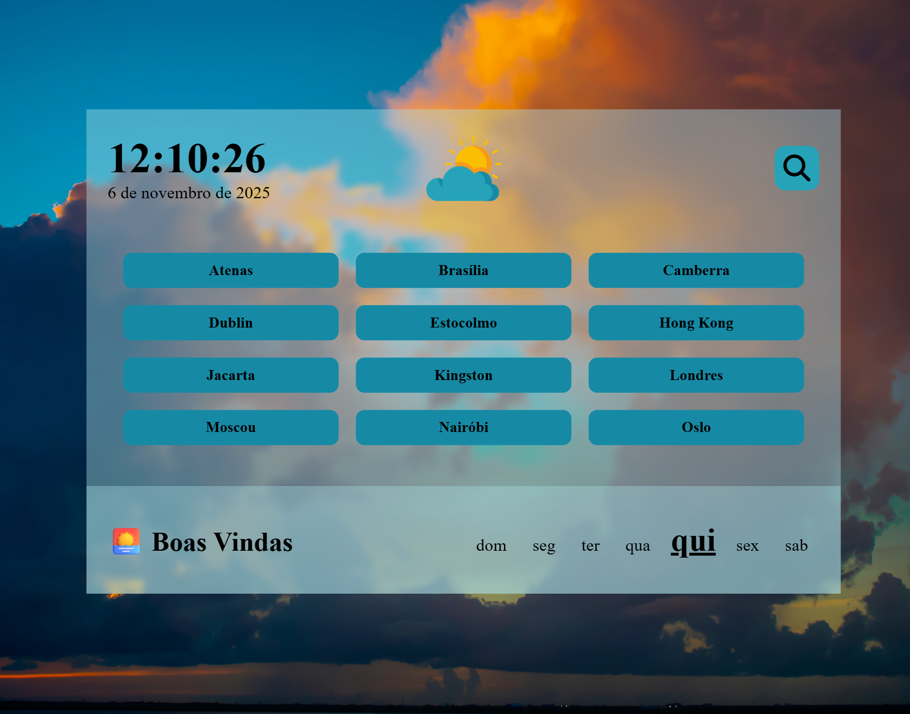
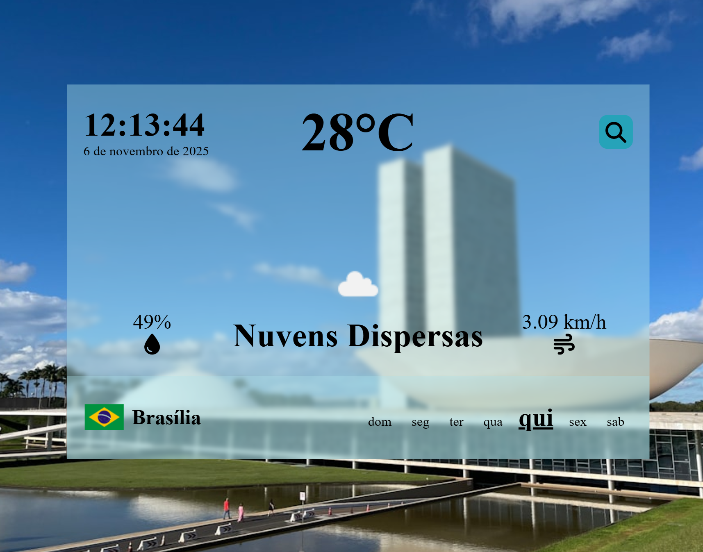
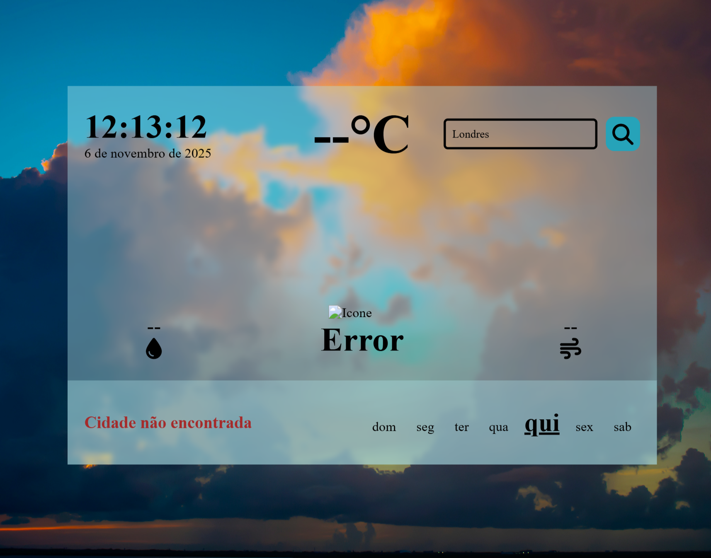

# Atmosfera Pro
O Atmosfera Pro é uma versão que visa melhorar o **UI/UX Design** do Tempo Exato! e integrar um **servidor back-end** para ocultar informações sensíveis.

### ☀️ Funcionalidades
- Permite ao usuário buscar informações climáticas de diferentes localidades
- Fornece sugestões de Capitais de diversos países na tela inicial
- Mostra dados de data, hora e dia da semana atualizados em tempo real
- Exibe dados de condições climáticas e temperatura, nome da cidade e a bandeira do país

### 🖥️ Tecnologias utilizada
- HTML5, CSS3 e JS
- Node.js e bibliotecas
- API OpenWeatherMap

### 🗝️ Configuração do Server
1. Crie uma conta e obtenha uma chave da API
- Acesse: https://home.openweathermap.org/api_keys
- Crie uma chave gratuita (API Key) para seu usuário.
2. Na pasta `server/` crie um arquivo chamado `.env` com o conteúdo:
```
API_WEATHER = SUA_API_KEY
```
3. Instale as dependências
``` 
npm install
```
4. Inicie o servidor
``` 
npm run server
```

## Screenshots
<div>
  <h3>Home - Result - Error Handling</h3>
  
  
  
</div>

### 🎨 Créditos
Baseado no layout criado por [Dan Tsonkov](https://www.dantsonkov.com/), disponível em [Dibbble](https://dribbble.com/shots/2232422-004-Weather-Widget).